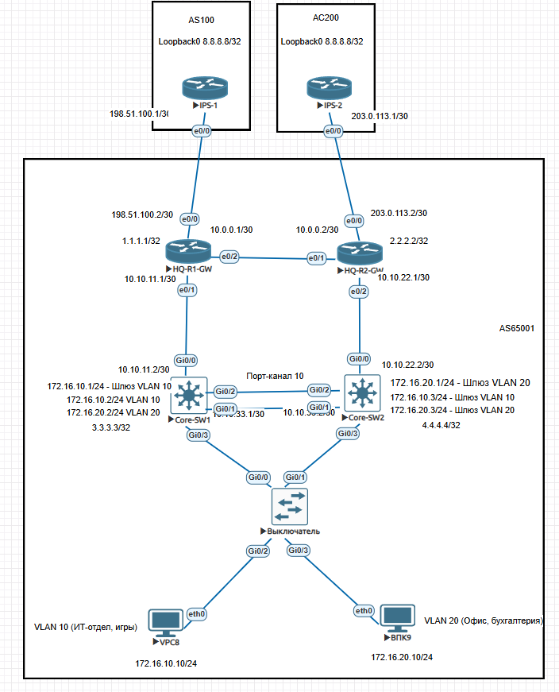

# enterprise-dual-homing-lab
Fault-tolerant Enterprice network design &amp; deployment in EVE-NG. Features Dual-Homing eBGP/iBGP, OSPF with BFD, HSRP wih Object Tracking, MSTP, and L3 EtherChannel
# 🌐 Design & Deployment of Fault-Tolerant Enterprise Network (Dual-Homing BGP / OSPF / HSRP / MSTP)

Лабораторный проект по проектированию и развертыванию отказоустойчивой корпоративной сети Enterprise-уровня в среде **EVE-NG**.

---

## 📐 Архитектура сети и Топология



### Основные параметры и IP-план
* **Внешний периметр (eBGP):**
  * `HQ-R1-GW` (AS 65001) <-> `ISP-1` (AS 100): `198.51.100.0/30`
  * `HQ-R2-GW` (AS 65001) <-> `ISP-2` (AS 200): `203.0.113.0/30`
* **Ядро сети (OSPF Area 0):**
  * `HQ-R1-GW` <-> `HQ-R2-GW`: `10.0.0.0/30`
  * `HQ-R1-GW` <-> `Core-SW1`: `10.10.11.0/30` (Direct L3 Link Gi0/0)
  * `HQ-R2-GW` <-> `Core-SW2`: `10.10.22.0/30` (Direct L3 Link Gi0/0)
  * Loopback-адреса устройств: R1 (`1.1.1.1`), R2 (`2.2.2.2`), Core-SW1 (`3.3.3.3`), Core-SW2 (`4.4.4.4`)
* **Сегменты доступа и FHRP (HSRP):**
  * **VLAN 10 (IT / Services):** `172.16.10.0/24` | VIP: `172.16.10.1` (Active: Core-SW1)
  * **VLAN 20 (Office / Staff):** `172.16.20.0/24` | VIP: `172.16.20.1` (Active: Core-SW2)

---

## 🛠️ Реализованные технологии и стек

### 1. L2 Switching & High Availability (MSTP & EtherChannel)
* **MSTP (802.1s):** Настроены 2 инстанса для балансировки нагрузки между L3-коммутаторами ядра.
  * Instance 1 (VLAN 10): Core-SW1 — Root Primary, Core-SW2 — Root Secondary.
  * Instance 2 (VLAN 20): Core-SW2 — Root Primary, Core-SW1 — Root Secondary.
* **L2 EtherChannel (LACP):** Объединение каналов между Core-SW1 и Core-SW2 (Port-Channel 10) с явным усечением разрешенных VLAN (Trunk allowed).
* **L2 Security:** На портах доступа включены `PortFast` и `BPDU Guard` для защиты от несанкционированного подключения коммутаторов.

### 2. Core Routing & Sub-Second Convergence (OSPF & BFD)
* **OSPFv2 Area 0:** Динамическая маршрутизация внутри компании. SVI-интерфейсы объявлены как `passive-interface` для исключения рассылки служебного трафика в пользовательские сегменты.
* **BFD (Bidirectional Forwarding Detection):** Интегрирован с OSPF на всех L3-интерконнектах ядра (таймеры 50ms/multiplier 3) для бесшовной сходимости таблицы маршрутизации (<100мс при обрывах).

### 3. First Hop Redundancy Protocol (HSRP + Object Tracking)
* **HSRP (Standby):**
  * Разделение ролей Active/Standby для разных VLAN на разном оборудовании.
  * Виртуальный IP одновременно служит Gateway по умолчанию для клиентов, а SVI-адреса коммутаторов (например, `.2` и `.3`) используются для удаленного администрирования.
  * Включен режим `preempt`.
* **Object Tracking:** Привязано отслеживание состояния L3-аплика (Track) к группам HSRP. При падении аплинка приоритет автоматически декрементируется на 20, бесшовно переводя статус Active на резервный коммутатор.

### 4. Edge & Exterior Routing (eBGP / iBGP & Traffic Engineering)
* **eBGP:** Установление связей с ISP-1 (AS100) и ISP-2 (AS200).
* **iBGP & Next-Hop-Self:** Построение iBGP-сессии между R1 и R2 через Loopback-адреса.
* **Aggregate Route:** Генерация суммарного префикса `172.16.0.0/16` через `Null0` для анонса наружу.
* **Local Preference (Outbound Control):** Маршрутам от ISP-1 присваивается `Local-Preference 500`, делая ISP-1 основным исходящим каналом для всей AS.
* **AS-Path Prepend (Inbound Control):** Для анонсов в сторону ISP-2 применяется искусственное удлинение пути AS-Path, принуждая входящий интернет-трафик идти через ISP-1 (ISP-2 выполняет роль Backup).

---

## 🔍 Верификация и Команды проверки

Примеры ключевых команд проверки состояния сети:

```bash
# Проверка L2 EtherChannel & MSTP
Core-SW1# show etherchannel summary
Core-SW1# show spanning-tree mst 1

# Проверка OSPF & BFD
Core-SW1# show ip ospf neighbor
Core-SW1# show bfd neighbors

# Проверка статуса отказоустойчивости шлюзов HSRP
Core-SW1# show standby brief

# Проверка BGP сессий и таблицы маршрутов
HQ-R1-GW# show ip bgp summary
HQ-R1-GW# show ip bgp
```
